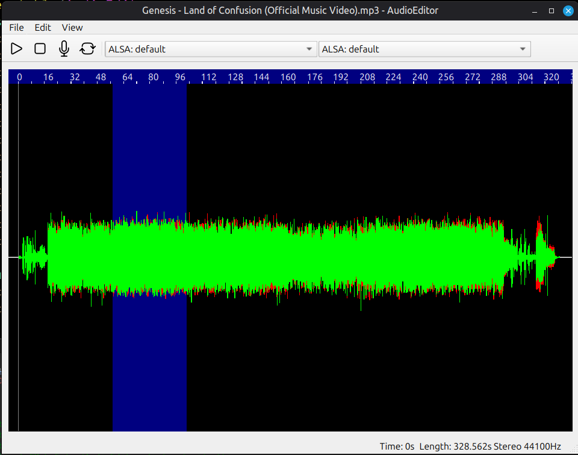

# A Simple Audio Editor using QT6

## Features / Limitations
* Supports all formats that libsndfile supports
* Playback using PortAudio
* Single mono/stereo audio track

## Building
Uses CMake.
Depends on Qt6, libsndfile and PortAudio.

## Contributing
Feel free to create issues/send PRs :)
